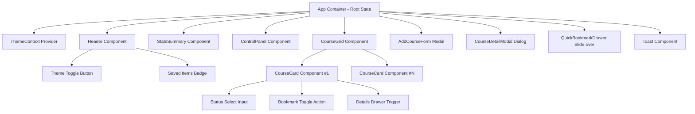

# React App Project - EDquest EduFlow Workspace

[](https://react.dev/)
[](https://vitejs.dev/)
[](https://vitest.dev/)
[](LICENSE)

An interactive, production-grade React web application engineered to demonstrate **React Component Composition**, **Props Contracts**, **Unidirectional Data Flow**, **State Lifting**, and modern **Hooks Architecture**.

---

## 🌟 Key Architectural Objectives

- **Component Decomposition**: Structured as modular, single-responsibility functional components.
- **Strict Props Contracts**: Explicit passing of data props and action callback handlers down the component tree.
- **Unidirectional Data Flow**: State is centralized in the root `App` container and lifted upstream via event callbacks.
- **Hooks & Performance**: Utilizes `useMemo` for derived statistics and filtered queries, `useCallback` to maintain handler identity, `useState` for state management, and `useEffect` for `localStorage` synchronization.
- **Interactive UI & Design System**: Responsive flexbox and CSS Grid layout with custom CSS variables, dark/light mode context theme switching, modal dialogs, slide-over drawer, progress sliders, and toast feedback.
- **Automated Test Suite**: Unit and integration test coverage using Vitest and React Testing Library.

---

## 📐 Component Architecture & Taxonomy



---

## 📋 Props Contract Catalog

| Component | Prop Name | Type | Description |
|---|---|---|---|
| **Header** | `title` | `string` | App branding heading text |
| | `subtitle` | `string` | Descriptive app tagline |
| | `bookmarkedCount` | `number` | Counter badge for saved items |
| | `onOpenBookmarks` | `function()` | Callback to open saved bookmarks drawer |
| | `onOpenAddModal` | `function()` | Callback to trigger create course modal |
| | `onResetAll` | `function()` | Callback to reset local state to initial defaults |
| **StatsSummary** | `totalCourses` | `number` | Total number of courses in dataset |
| | `completedCourses` | `number` | Count of courses marked as Completed |
| | `inProgressCourses` | `number` | Count of courses currently In Progress |
| | `totalHours` | `number` | Sum of total course duration hours |
| | `completionRate` | `number` | Calculated percentage of completed courses |
| **ControlPanel** | `searchQuery` | `string` | Active search input value |
| | `onSearchChange` | `function(query)` | Callback updating root search query state |
| | `selectedCategory` | `string` | Selected category filter tab |
| | `onCategoryChange` | `function(category)` | Callback updating root category filter |
| | `selectedStatus` | `string` | Selected status filter option |
| | `onStatusChange` | `function(status)` | Callback updating root status filter |
| | `selectedDifficulty` | `string` | Selected difficulty level |
| | `onDifficultyChange` | `function(difficulty)` | Callback updating root difficulty filter |
| | `sortBy` | `string` | Sort parameter ('title' \| 'rating' \| 'progress' \| 'duration') |
| | `onSortChange` | `function(sortBy)` | Callback updating sorting criterion |
| | `onClearFilters` | `function()` | Callback resetting all search and filter conditions |
| **CourseCard** | `course` | `object` | Comprehensive course entity (id, title, category, progress, status, etc.) |
| | `onToggleBookmark` | `function(id)` | Callback to toggle bookmark boolean flag |
| | `onUpdateStatus` | `function(id, status)` | Callback to update course execution status |
| | `onViewDetails` | `function(course)` | Callback to open detail modal for targeted course |
| | `onDeleteCourse` | `function(id)` | Callback to remove course from main state |
| **AddCourseForm** | `isOpen` | `boolean` | Modal visibility flag |
| | `onClose` | `function()` | Callback closing modal overlay |
| | `onAddCourse` | `function(newCourse)` | Callback lifting newly constructed course entity to root |
| **CourseDetailModal**| `isOpen` | `boolean` | Detail dialog visibility flag |
| | `course` | `object \| null` | Targeted course object |
| | `onClose` | `function()` | Callback closing dialog |
| | `onUpdateProgress` | `function(id, val)` | Callback updating numeric completion percentage |
| | `onUpdateNotes` | `function(id, notes)` | Callback updating study notes text |

---

## 🔄 Unidirectional Data Flow Strategy

1. **State Ownership**: Primary state (`courses`, `searchQuery`, `selectedCategory`, `selectedStatus`, `selectedDifficulty`, `sortBy`, `modals`) resides exclusively in the root `App` component.
2. **Prop Down-Passing**: Read-only state and calculated metrics flow downward to child components (`Header`, `StatsSummary`, `ControlPanel`, `CourseGrid`, `CourseCard`).
3. **Event Up-Lifting**: User actions (button clicks, form submits, status dropdown changes, range slider inputs) trigger callback functions passed as props, updating root state in `App`.
4. **Derived Computations**: `useMemo` hooks automatically recalculate `filteredCourses` and `stats` whenever root state changes without unnecessary component re-renders.

---

## 🛠️ Installation & Setup Guide

### 1. Install Dependencies
```bash
npm install
```

### 2. Launch Local Development Server
```bash
npm run dev
```
Open [http://localhost:5173](http://localhost:5173) in your browser.

### 3. Execute Automated Tests
```bash
npm test
```

### 4. Build for Production
```bash
npm run build
```

---

## 👤 Author
**Animesh Devarkar**  
GitHub: [@animeshDevarkar](https://github.com/animeshDevarkar)
